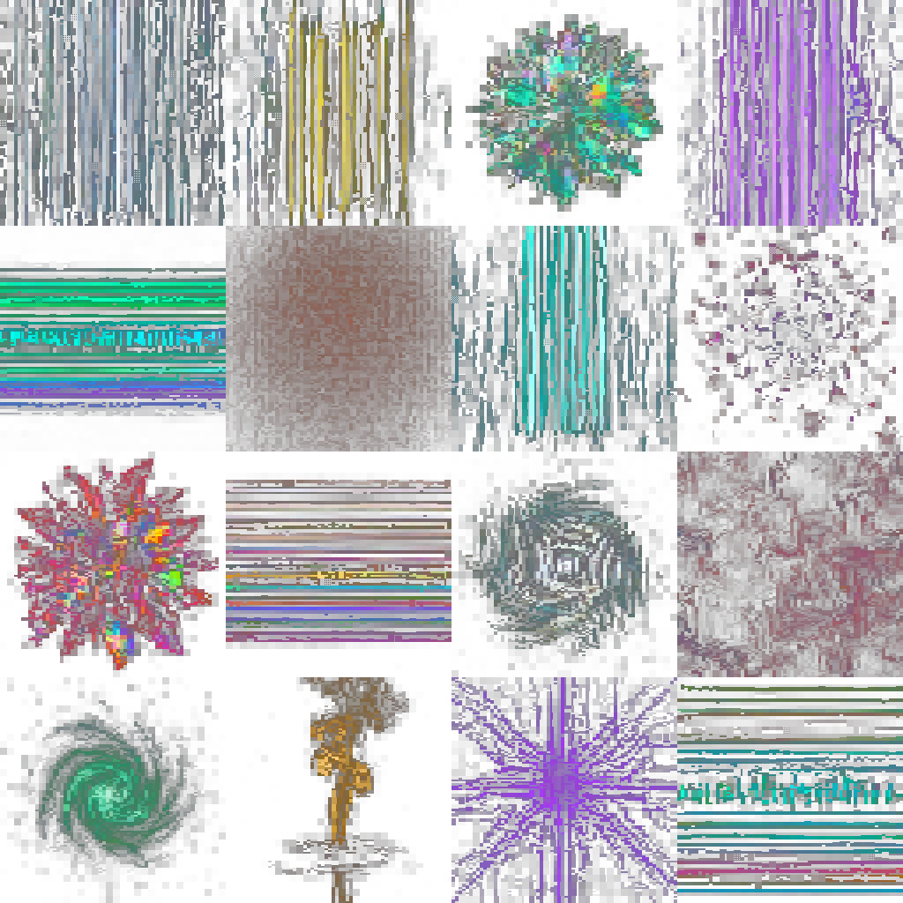
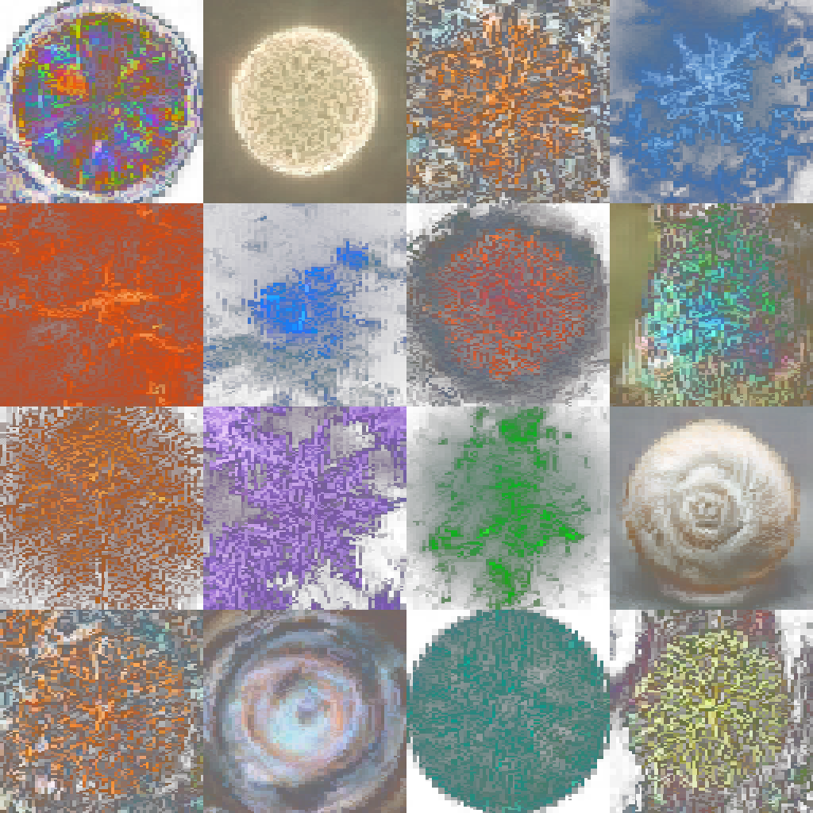
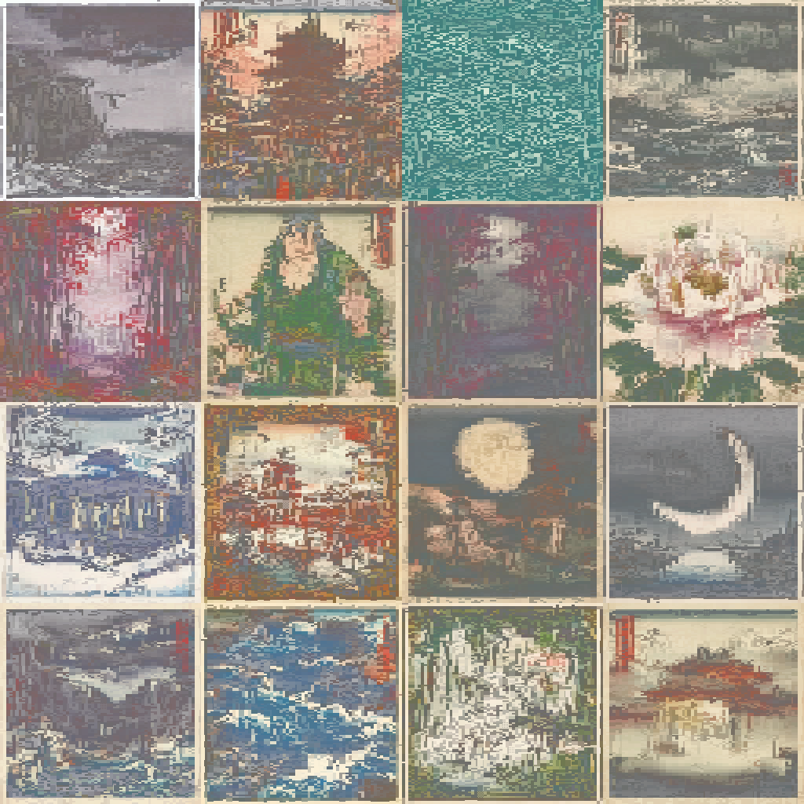
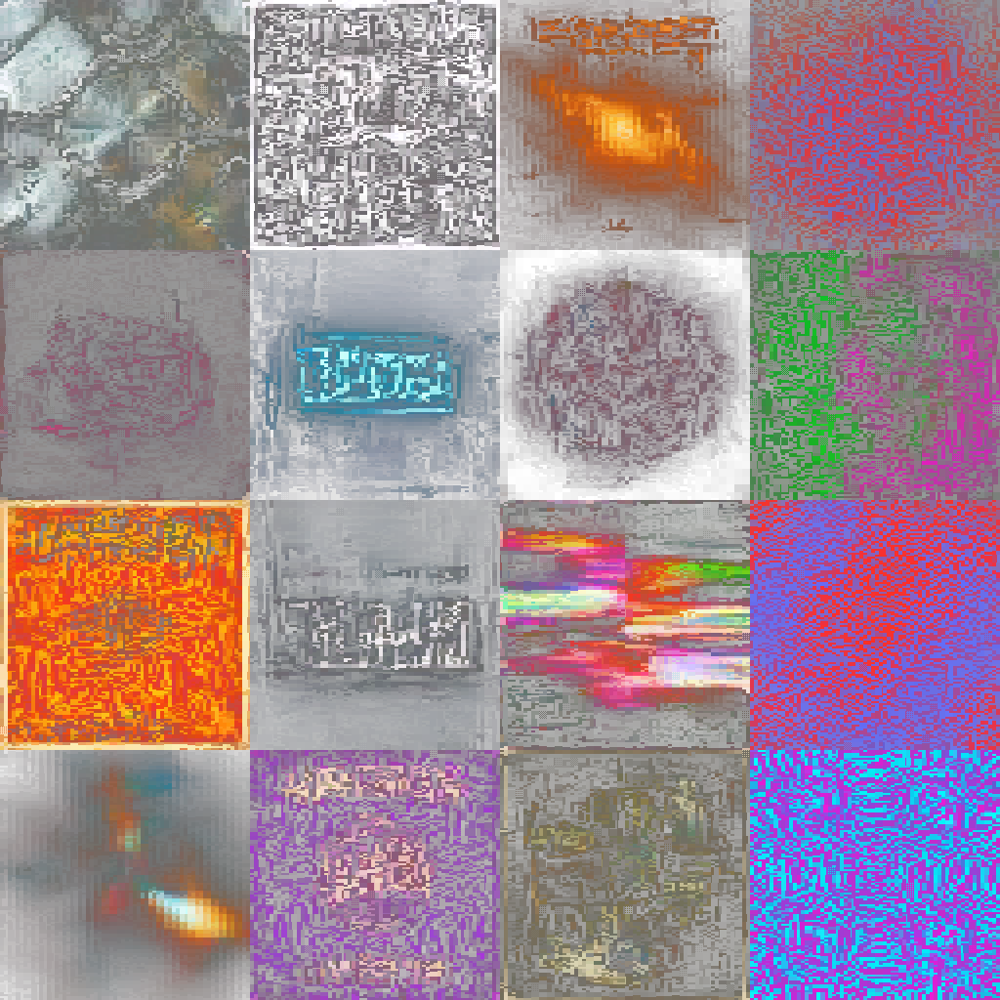
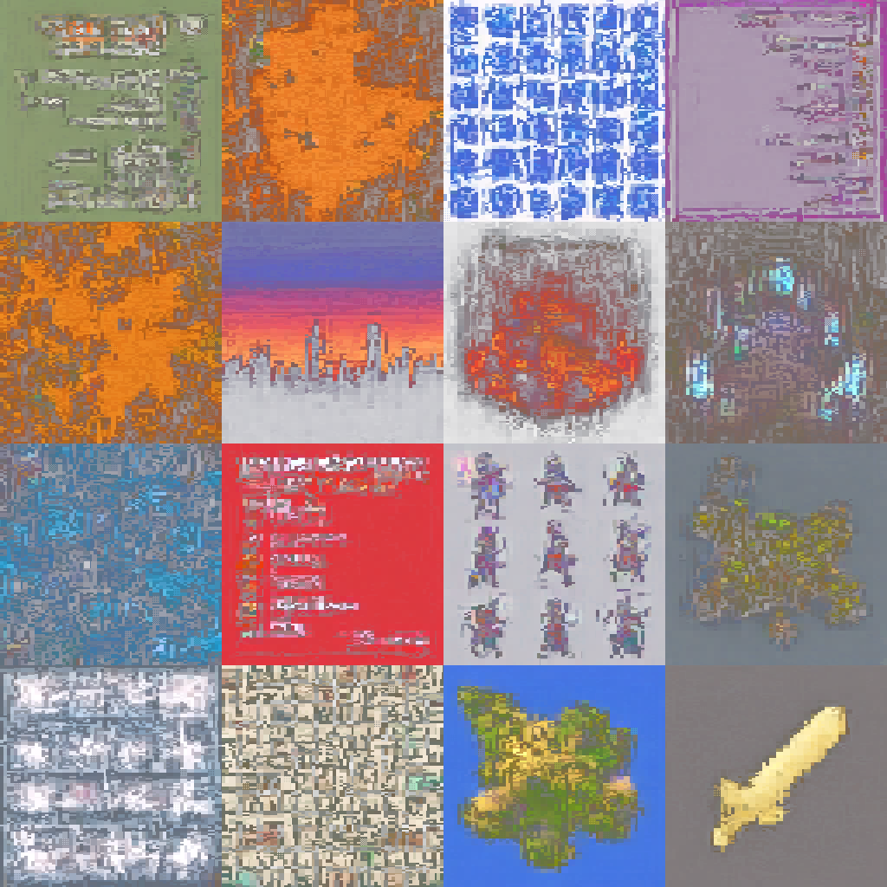
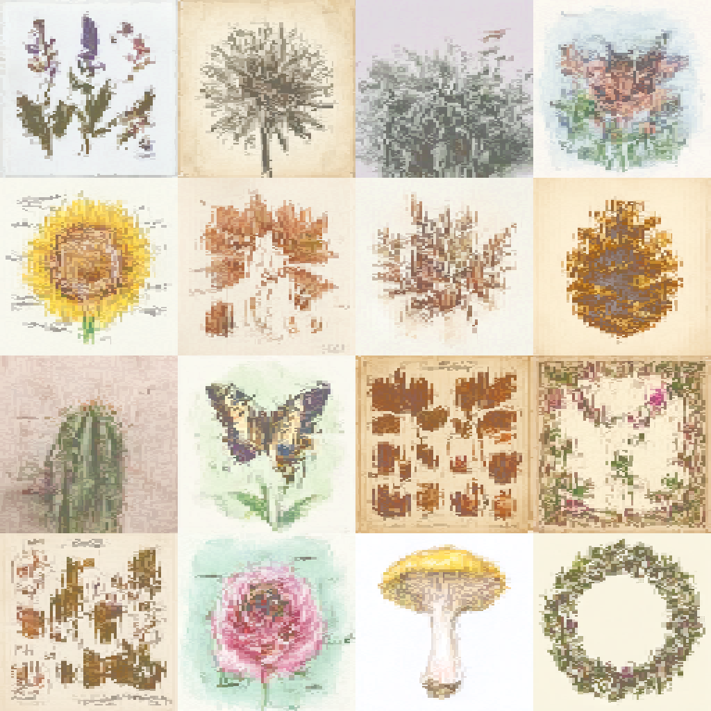
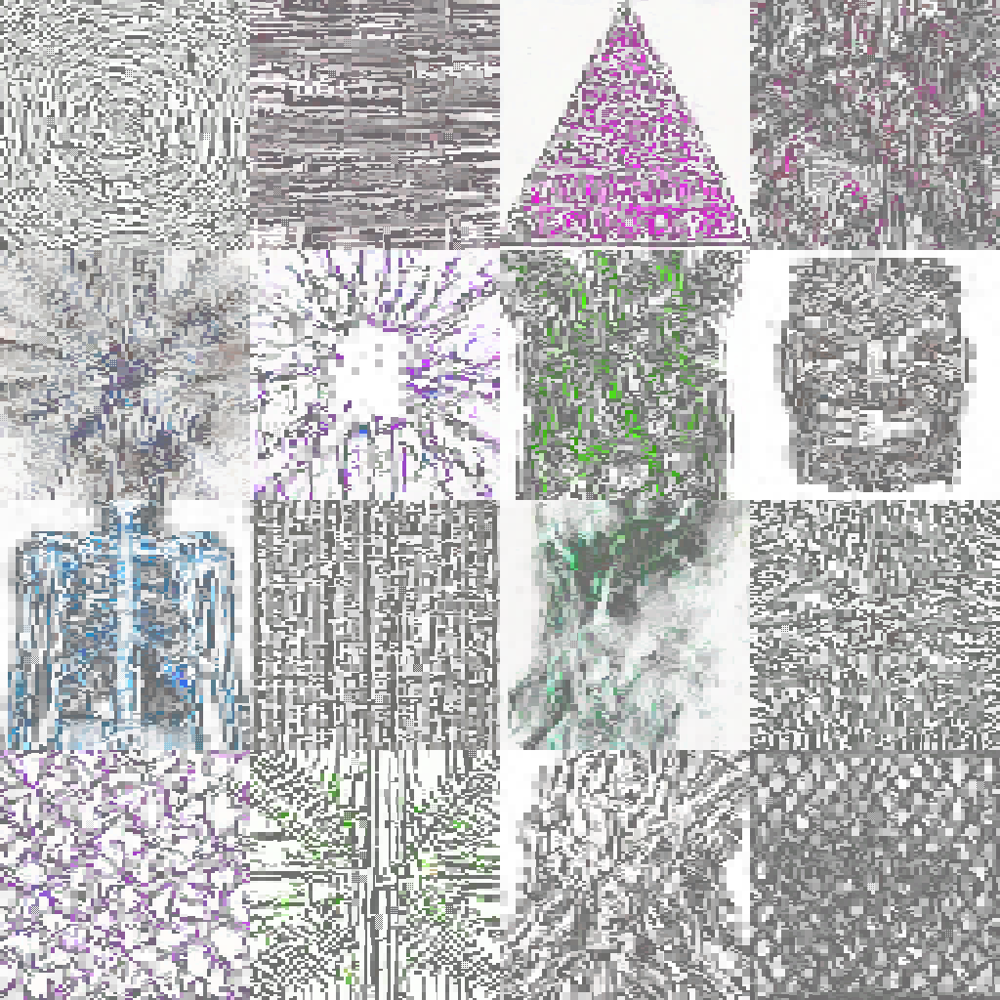
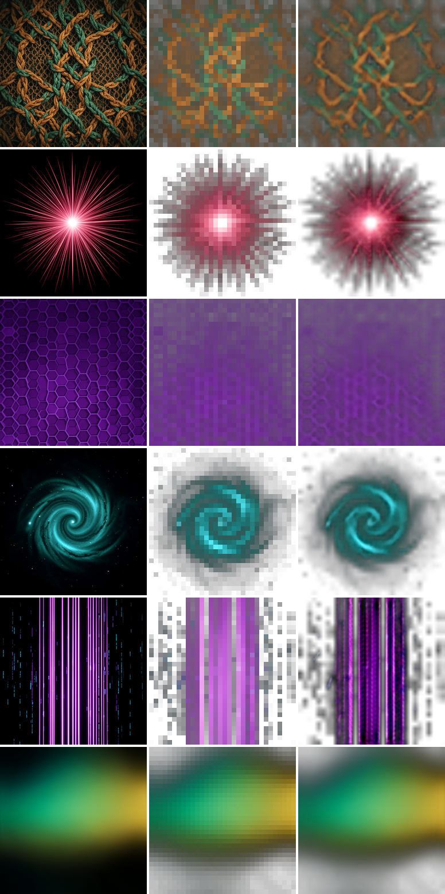

# EASEy-GLYPH: Audio-Reactive Generative Glyph Visuals

Initially released as a Stable Diffusion experiment, the Effortless Audio-Synesthesia Experience ([EASE](https://github.com/kevinraymond/ease)), was my first semi-deep trip into serious audio reactive visuals. It could have its place, but definitely is too heavy for many non-CUDA machines.

Enter [EASEy-GLYPH](https://github.com/kevinraymond/easey-glyph). The core design goal was to make real-time generative visuals accessible on Apple M1 hardware, which I quickly discovered was not going to be any typical diffusion-based solution. The entire architecture works backwards from that constraint: a 34M-parameter flow-matching model generates 32x32 glyph grids (not pixels) that render into stylized, low-resolution visuals at 60fps on modest hardware. The low resolution isn't a limitation - it's an intentional aesthetic choice that produces chunky, graphic visuals with real transparency and color depth. An optional "super-resolution" CNN can upscale to 256x256 when the hardware budget allows.

Read more about the app in its repo. This HF repo is for the models I'm including so you can try it out right away! Training your own models is relatively quick as well with a decent GPU, with scripts in the app repo.

_NOTE: LLM generated content below_

---

## Sample Outputs

<table>
<tr>
<td align="center"><br><b>Abstract</b></td>
<td align="center"><br><b>Nature</b></td>
<td align="center"><br><b>Ukiyo-e</b></td>
<td align="center"><br><b>Albums</b></td>
</tr>
<tr>
<td align="center"><br><b>Pixel</b></td>
<td align="center"><br><b>Botanical</b></td>
<td align="center"><br><b>Darkpsy</b></td>
<td></td>
</tr>
</table>

## Base vs Realtime Models

Each variant ships with two FlowUNet models:

- **Base** — unconditional generation. Good for ambient visuals, pool-based morphing, and general exploration.
- **Realtime (CFG)** — trained with classifier-free guidance on audio features. Required for live audio-reactive performance where audio maps to visual effects via CFG conditioning.

Both model types share the same architecture (34M params) and are interchangeable at load time. The realtime models were trained with random audio labels (not semantic features) fixed per-image, so the model learns to distinguish conditioned vs unconditioned generation. At inference, real audio features are z-score normalized into the same range, and CFG amplifies the difference — the reactivity is emergent, not a learned "bass = dark" mapping.

For live performance, **use the realtime models**.

## Model Variants

### Abstract

| File | Type | Params | Description |
|------|------|--------|-------------|
| `easey-glyph-flow-abstract-v2.safetensors` | FlowUNet | 34M | Base (unconditional) |
| `easey-glyph-flow-abstract-v2-realtime.safetensors` | FlowUNet | 34M | Realtime (CFG, audio-reactive) |
| `easey-glyph-superres-abstract-v2.safetensors` | SuperRes | 779K | 32→256 upscaler (optional) |

### Nature

| File | Type | Params | Description |
|------|------|--------|-------------|
| `easey-glyph-flow-nature.safetensors` | FlowUNet | 34M | Base (unconditional) |
| `easey-glyph-flow-nature-realtime.safetensors` | FlowUNet | 34M | Realtime (CFG, audio-reactive) |
| `easey-glyph-superres-nature.safetensors` | SuperRes | 779K | 32→256 upscaler (optional) |

### Ukiyo-e

| File | Type | Params | Description |
|------|------|--------|-------------|
| `easey-glyph-flow-ukiyoe.safetensors` | FlowUNet | 34M | Base (unconditional) |
| `easey-glyph-flow-ukiyoe-realtime.safetensors` | FlowUNet | 34M | Realtime (CFG, audio-reactive) |
| `easey-glyph-superres-ukiyoe.safetensors` | SuperRes | 779K | 32→256 upscaler (optional) |

### Albums

| File | Type | Params | Description |
|------|------|--------|-------------|
| `easey-glyph-flow-albums.safetensors` | FlowUNet | 34M | Base (unconditional) |
| `easey-glyph-flow-albums-realtime.safetensors` | FlowUNet | 34M | Realtime (CFG, audio-reactive) |
| `easey-glyph-superres-albums.safetensors` | SuperRes | 779K | 32→256 upscaler (optional) |

### Pixel

| File | Type | Params | Description |
|------|------|--------|-------------|
| `easey-glyph-flow-pixel.safetensors` | FlowUNet | 34M | Base (unconditional) |
| `easey-glyph-flow-pixel-realtime.safetensors` | FlowUNet | 34M | Realtime (CFG, audio-reactive) |
| `easey-glyph-superres-pixel.safetensors` | SuperRes | 779K | 32→256 upscaler (optional) |

### Botanical

| File | Type | Params | Description |
|------|------|--------|-------------|
| `easey-glyph-flow-botanical.safetensors` | FlowUNet | 34M | Base (unconditional) |
| `easey-glyph-flow-botanical-realtime.safetensors` | FlowUNet | 34M | Realtime (CFG, audio-reactive) |
| `easey-glyph-superres-botanical.safetensors` | SuperRes | 779K | 32→256 upscaler (optional) |

### Darkpsy

| File | Type | Params | Description |
|------|------|--------|-------------|
| `easey-glyph-flow-darkpsy.safetensors` | FlowUNet | 34M | Base (unconditional) |
| `easey-glyph-flow-darkpsy-realtime.safetensors` | FlowUNet | 34M | Realtime (CFG, audio-reactive) |
| `easey-glyph-superres-darkpsy.safetensors` | SuperRes | 779K | 32→256 upscaler (optional) |

Each `.safetensors` file has a companion `.json` sidecar with model config and training metadata.

## Quick Start

```bash
# Clone and install
git clone https://github.com/kevinraymond/easey-glyph.git
cd easey-glyph
uv sync

# Download models
uv run pip install huggingface-hub
huggingface-cli download kjraym/easey-glyph --local-dir ./models

# Run with realtime model (recommended for live performance)
uv run python -m easey_glyph \
    --checkpoint models/easey-glyph-flow-abstract-v2-realtime.safetensors

# Add optional super-resolution (trades fps for sharper output)
uv run python -m easey_glyph \
    --checkpoint models/easey-glyph-flow-abstract-v2-realtime.safetensors \
    --superres models/easey-glyph-superres-abstract-v2.safetensors
```

Opens a browser UI at `http://localhost:8420` with:
- Real-time generation at ~60fps
- Audio input (file or system monitor)
- 12 audio features mappable to 11 visual effects
- Beat-triggered grid morphing
- NDI/Syphon/Spout output for VJ software
- Real alpha, not black
- MIDI controller support

## Architecture

### Glyph Grid Representation

Images are encoded as 32x32 grids of 16-channel "glyphs":
- 8 channels: PCA-compressed visual embedding
- 4 channels: foreground RGBA
- 4 channels: background RGBA

This compact representation enables a small model to generate diverse, colorful outputs with real transparency (Porter-Duff compositing).

### FlowUNet (34M params)

A U-Net with time embedding for conditional flow matching (CFM). Generates glyph grids from Gaussian noise in 8 Euler steps.

- Base channels: 96
- Channel multipliers: [1, 2, 4, 4]
- Attention at 4x4 and 8x8 resolutions
- FiLM conditioning for audio features (12-dim)

The realtime variants are trained with classifier-free guidance (20% unconditional dropout) to enable CFG-scaled audio conditioning at inference time.

### GlyphSuperRes (779K params, optional)

An optional tiny CNN that upscales 32x32 rendered pixels to 256x256 using 3 PixelShuffle stages (8x). Global skip connection from bilinear upscale ensures quality baseline. Without SuperRes, the system renders at native glyph resolution with bilinear+nearest upscaling — still visually compelling and significantly faster on constrained hardware.

<p align="center">
<br>
<em>SuperRes pipeline: original image → glyph grid encoding → trained upscale back to high resolution</em>
</p>

## Training

FlowUNet models were trained with vanilla Conditional Flow Matching:
- Loss: `MSE(model(t, x_t), x_1 - x_0)` where `x_t = (1-t)*x_0 + t*x_1`
- Optimizer: Adam, lr=2e-4, cosine LR decay
- 15,000 kimg (~234k steps at batch size 64)
- EMA decay: 0.9999
- Single GPU training (TF32 enabled)

Realtime models were fine-tuned from base checkpoints with fixed per-image audio labels and 20% unconditional dropout for classifier-free guidance.

SuperRes models trained for 500 kimg on rendered glyph images paired with original source crops.

## File Format

Models are stored in [safetensors](https://github.com/huggingface/safetensors) format (inference weights only, no optimizer state). Each model file has a companion `.json` with:

```json
{
  "architecture": "FlowUNet",
  "model": {
    "image_size": 32,
    "in_channels": 16,
    "base_channels": 96,
    ...
  },
  "training": {
    "kimg": 15000.0,
    "step": 234375
  },
  "num_params": 34000000
}
```

## License

MIT
